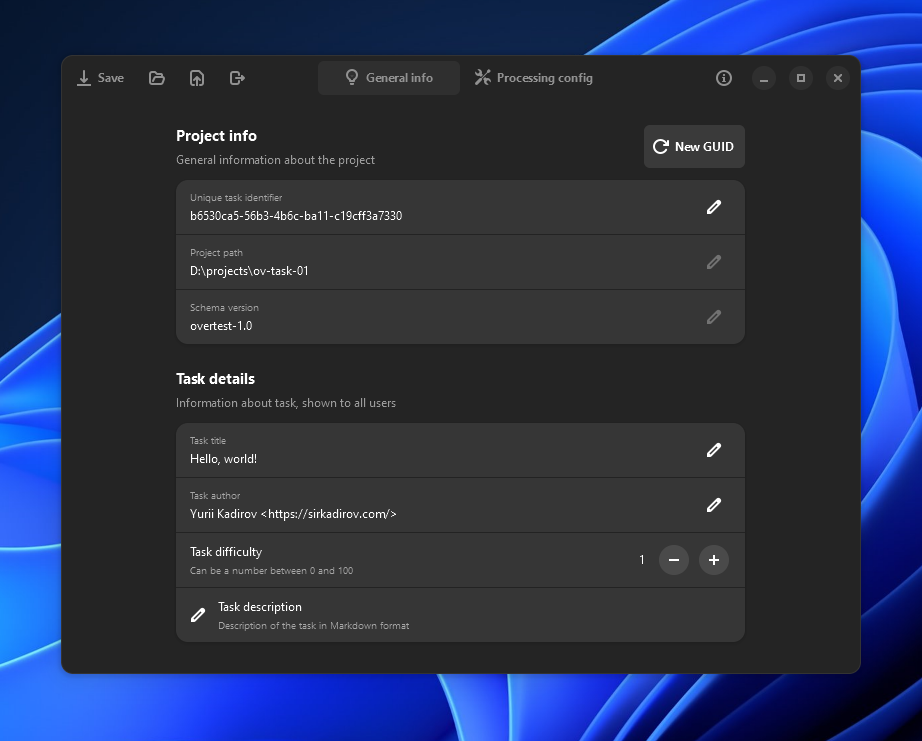

# Overtest TDE
Додаток **Overtest TDE** — це новий спосіб створення нових завдань для системи Overtest за допомогою зручного інтерфейсу на базі `GTK 4` та `libadwaita` для Windows (за допомогою `MSYS2`) та Linux з більшістю популярних графічних середовищ.



## Важливе зауваження
Станом на зараз, проєкт Overtest TDE знаходиться в стані активної розробки, і може змінюватися досить часто, разом з форматом збереження даних, файловою структурою, графічним інтерфейсом та іншими складовими частинами додатка. 

## Сторонні залежності
### Для збірки і роботи на Windows
- `MSYS2` ([офіційний сайт](https://www.msys2.org/)) зі встановленими пакетами `mingw-w64-x86_64-gtk4` ([деталі](https://packages.msys2.org/package/mingw-w64-x86_64-gtk4)) та `mingw-w64-x86_64-libadwaita` ([деталі](https://packages.msys2.org/package/mingw-w64-x86_64-libadwaita)), а також усіма їхніми залежностями
- Для коректної роботи програми, ви маєте встановити `MSYS2` у директорію, яка пропонується вам за замовчуванням, а саме `C:\msys64\`, або ж налаштувати змінну оточення (environment variable): `MSYS2_PATH=шлях_до_вашого_встановлення`
- Встановлена платформа .NET 8.0 SDK ([офіційний сайт](https://dot.net/)) з останніми оновленнями

### Для збірки і роботи на Linux
- Встановлена платформа .NET 8.0 SDK ([офіційний сайт](https://dot.net/)) з останніми оновленнями
- Більшість дистрибутивів Linux вже мають все необхідне для коректної роботи програми. Якщо з якихось причин Overtest TDE не запускається на вашому комп'ютері, скористайтеся інструкцією зі встановлення залежностей на [офіційному сайті GTK](https://www.gtk.org/docs/installations/linux/)
- Також, перевірте наявність у системі пакету, який надає доступ до функцій `libadwaita`. Для Ubuntu, до прикладу, цю бібліотеку можна встановити, виконавши наступну команду в терміналі: `sudo apt install -y libadwaita-1` (детальна інформація [на сайті Launchpad](https://launchpad.net/ubuntu/+source/libadwaita-1))

### Відсутність підтримки MacOS
На жаль, в середовищі операційної системи MacOS від Apple не підтримуються деякі з компонентів `GTK 4` та `libadwaita`, які активно використовуються в Overtest TDE. Якщо ви маєте бажання портувати додаток для цієї операційної системи — ми будемо щиро вдячні вашій допомозі!

## Ліцензія на програмне забезпечення
```
Overtest Tasks Development Environment
Copyright (C) 2023 Yurii Kadirov (aka Sirkadirov)
https://github.com/overtest/overtest-tde

This program is free software: you can redistribute it and/or modify
it under the terms of the GNU General Public License as published by
the Free Software Foundation, either version 3 of the License, or
(at your option) any later version.

This program is distributed in the hope that it will be useful,
but WITHOUT ANY WARRANTY; without even the implied warranty of
MERCHANTABILITY or FITNESS FOR A PARTICULAR PURPOSE. See the
GNU General Public License for more details.

You should have received a copy of the GNU General Public License
along with this program. If not, see <http://www.gnu.org/licenses/>.
```